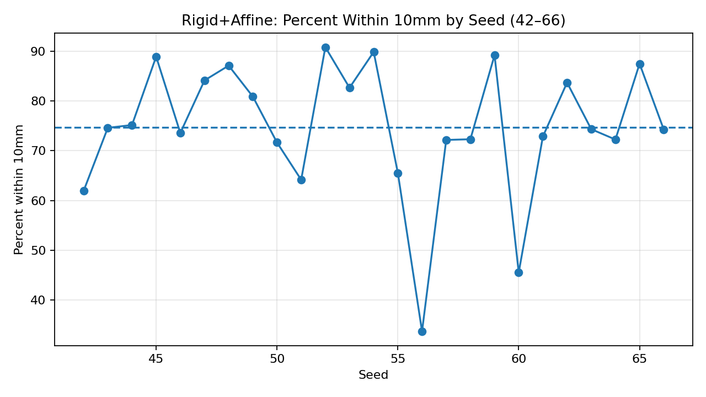
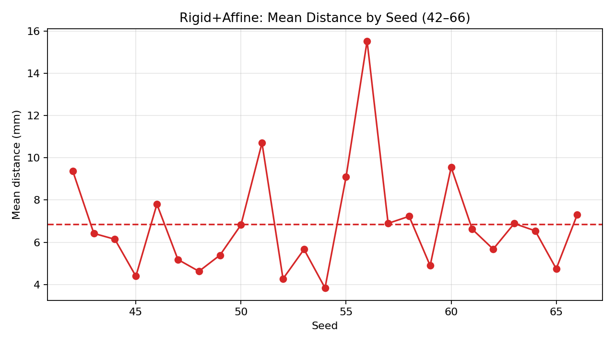
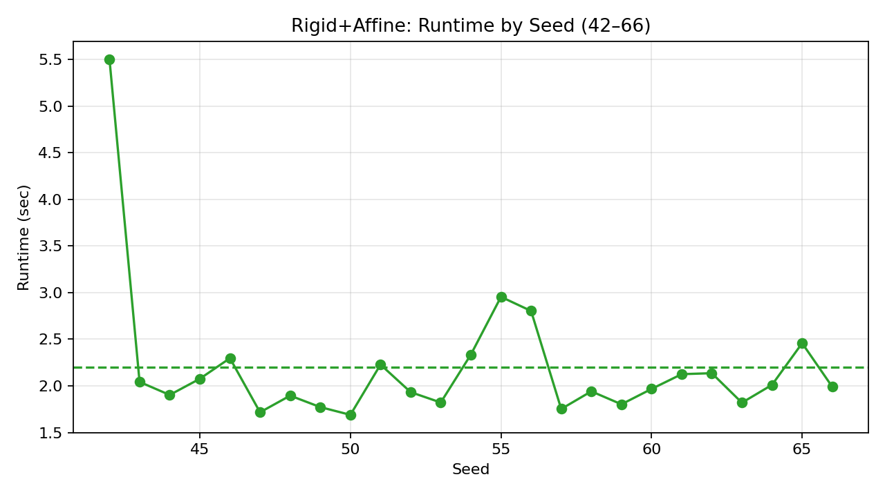

# PrediCT CAC Prototype

Building and comparing segmentation strategies for **Coronary Artery Calcium (CAC)** in the **ML4SCI PrediCT** project.

This branch implements a **modular, research‑grade pipeline** for:

- COCA dataset ingestion and preprocessing  
- atlas‑based registration with ImageCAS  
- calcium–centerline proximity evaluation  
- segmentation‑oriented data pipeline (splits, patch sampling, MONAI loaders)  
- Agatston scoring and future segmentation experiments

Repository: `MalyalaKarthik66/PrediCT` → branch `gsoc-predict-cac-prototype`.

---

## High‑Level Pipeline


**Pipeline Steps:**
- C: clip/normalize/resample/augment
- D: rigid + affine registration
- E: transform vessel zones
- F: KD-tree metrics
- G: plots + overlays

### Package Architecture


**Components:**
- A: raw DICOM, metadata
- B: HU window, normalize, resample, augment
- C: rigid + affine alignment
- D: proximity metrics
- E: splits, patch sampling, loaders
- F: plots, Agatston scoring

---

## What This Prototype Demonstrates

- **PrediCT Common Task – COCA preprocessing**
  - HU windowing \[-200, 1000] HU
  - z‑score normalization (per‑scan)
  - resampling to 1.0 mm³ isotropic voxels
  - optional ROI cropping
  - MONAI training augmentations (affine, elastic, noise, gamma)

- **PrediCT Project 3 Specific Task – Coronary atlas registration**
  - ImageCAS CCTA atlas → NCCT (COCA) via SimpleITK
  - Mattes Mutual Information, rigid + affine, multi‑resolution pyramid
  - calcium–centerline distance metrics and % within 10 mm
  - multi‑seed evaluation (seeds 42–66) with CSV + plots

- **Segmentation‑oriented data pipeline (for main GSoC project)**
  - 70/15/15 train/val/test split with seed 42  
  - Agatston‑aware stratification when scores are available (with safe fallback)
  - foreground‑biased patch sampler (positive patch prob. 0.8)
  - MONAI `CacheDataset` + PyTorch `DataLoader` with patch‑based loading

- **Reproducibility**
  - YAML‑driven configs (`configs/`)
  - CLI scripts (`scripts/`)
  - notebooks for statistics and visualization (`notebooks/`)
  - test suite (`pytest`) validating core components

---

## Repository Layout

```text
data/                 # raw DICOM, NIfTI, masks, metadata
outputs/              # registered atlas, vessel zones, plots, metrics
src/predict_cac/      # main modular prototype package
    data/             # ingestion & metadata
    transforms/       # HU window, normalization, resampling, aug
    datasets/         # COCA dataset, splits, patch sampler, loaders
    registration/     # atlas registration + centerline transforms
    evaluation/       # proximity metrics + visualization
    scoring/          # Agatston scoring & lesion attribution
scripts/              # CLI entry points (demo, preprocessing, registration, validation, training)
configs/              # YAML configs for preprocessing, registration, segmentation
notebooks/            # dataset statistics, registration & evaluation notebooks
experiments/          # CSV metrics and summary tables
docs/                 # documentation and saved figures
tests/                # pytest unit tests
```

---

## Environment Setup

> **Recommendation:** use a local virtual environment `.venv` for all commands.

### 1) Create and activate `.venv`

```bash
python -m venv .venv
```

Windows PowerShell:

```powershell
.\.venv\Scripts\Activate.ps1
```

Linux/macOS:

```bash
source .venv/bin/activate
```

### 2) Install dependencies

Using `pip`:

```bash
pip install -r requirements.txt
```

Conda alternative:

```bash
conda env create -f environment.yml
conda activate predict-cac
```

---

## Data Layout

For **real COCA + ImageCAS** processing, the expected layout is:

```text
data/
  raw/
    dicom/
      coca/             # COCA DICOM series (by patient)
  atlas/
    imagecas/           # ImageCAS atlas NIfTI + metadata
  masks/                # (optional) calcium masks for evaluation
```

Synthetic demo data is written under:

```text
data/
  preprocessed/         # standardized CT volumes (demo or real)
  masks/                # demo calcium mask
outputs/
  centerlines_warped/   # transformed atlas centerline masks
  vessel_zone_masks/    # ±10 mm vessel zones
```

Paths and options are controlled by:

- `configs/preprocessing.yaml`
- `configs/registration/*.yaml`
- `configs/segmentation.yaml`

---

## Quickstart: Demo Pipeline (No COCA Access Needed)

This mode generates synthetic CT, calcium mask, and centerlines so reviewers can run
the **entire pipeline** without private data.

```bash
# activate .venv first
python scripts/generate_demo_data.py
python scripts/run_preprocessing.py --config configs/preprocessing.yaml --max-scans 2
python scripts/run_registration.py --config configs/registration/affine.yaml
python scripts/run_validation.py --config configs/segmentation.yaml
```

Demo artifacts include:

- `data/preprocessed/sample_fixed.nii.gz`
- `data/preprocessed/sample_moving.nii.gz`
- `data/masks/sample_calcium_mask.nii.gz`
- `outputs/centerlines_warped/sample_centerline_mask.nii.gz`
- `experiments/registration_comparison.csv`
- `experiments/registration_comparison_summary.csv`
- plots under `docs/images/`

---

## COCA + ImageCAS: Real‑Data Workflow

With COCA and ImageCAS available:

```bash
# 1. Ingest COCA DICOM → NIfTI + metadata
python scripts/run_ingest.py

# 2. Preprocess CT volumes (clip / normalize / resample / optional crop / augment)
python scripts/run_preprocessing.py --config configs/preprocessing.yaml

# 3. Register ImageCAS atlas (rigid + affine) to NCCT scans
python scripts/run_registration.py --config configs/registration/affine.yaml

# 4. Compute distance metrics and generate overlays + histograms
python scripts/run_validation.py --config configs/segmentation.yaml
```

Adjust input/output paths in `configs/` to point to your COCA NIfTI files, atlas volumes,
and (optionally) calcium masks.

---

## Segmentation Data Pipeline

The segmentation‑oriented pipeline is implemented but currently used for **pipeline
validation**, not large‑scale model benchmarking yet.

Key pieces:

- **Preprocessing** (`configs/preprocessing.yaml`)
  - `hu_min=-200`, `hu_max=1000`
  - `normalization_mode=per_scan` (z‑score)
  - `target_spacing=[1.0, 1.0, 1.0]`
  - optional ROI cropping
  - train‑only augmentations:
    - affine (±15°, ±10 % scale)
    - optional elastic deformation
    - Gaussian noise
    - random gamma

- **Splits + loaders** (`configs/segmentation.yaml`, `src/predict_cac/datasets/`)
  - 70/15/15 train/val/test split with `seed=42`
  - Agatston‑aware stratification when score labels exist; safe random‑split fallback otherwise
  - foreground‑biased patch sampler (`positive_patch_probability=0.8`)
  - MONAI `CacheDataset` + PyTorch `DataLoader`, patch size e.g. `[64, 64, 32]`

### Validate the Segmentation Pipeline

```bash
# activate .venv first
python scripts/train_segmentation.py --config configs/segmentation.yaml
```

This script:

- builds the splits and loaders,  
- samples a few training batches, printing shapes and positive voxel fractions,  
- runs a short 5‑epoch U‑Net training loop to confirm the data pipeline is sound.

Example console summary:

```json
{
  "status": "pipeline_validated",
  "model_name": "unet",
  "epochs": 5,
  "split_counts": {"train": 2, "val": 0, "test": 0},
  "patch_size": [64, 64, 32],
  "positive_patch_probability": 0.8,
  "note": "Data split, CacheDataset loading, patch sampling, and train-time augmentation validated."
}
```

---

## Registration Evaluation and Metrics

Multi‑seed evaluation is run via:

```bash
# activate .venv first
python scripts/run_registration_comparison.py --seed-start 42 --seed-end 66
```

This writes:

- `experiments/registration_comparison.csv`  – per‑seed metrics  
- `experiments/registration_comparison_summary.csv` – mean/median/std across seeds  

### Example Plots (Seeds 42–66)

These figures are committed under `docs/images/`:

- **Percent within 10 mm by Seed**

  

- **Mean Distance by Seed**

  

- **Runtime by Seed**

  

### Latest Summary (rigid + affine, seeds 42–66)

From `experiments/registration_comparison_summary.csv`:

| Metric                               | Value      |
|--------------------------------------|-----------:|
| Mean distance (mean across seeds)    | 6.86 mm    |
| Mean distance (median across seeds)  | 6.54 mm    |
| Percent within 10 mm (mean)          | 74.73 %    |
| Percent within 10 mm (median)        | 74.31 %    |
| Runtime per scan (mean)              | 1.98 s     |
| Runtime per scan (median)            | 1.78 s     |

### Strategy Overview

Only one strategy is currently evaluated:

| Registration Strategy        | Runtime/scan (mean) | Mean Distance (mm) | % Within 10 mm |
|-----------------------------|---------------------:|--------------------:|---------------:|
| Rigid + Affine (`rigid_affine`) | 1.98 s             | 6.86 mm            | 74.73 %        |

The registration pipeline uses **rigid initialization followed by affine refinement**,
with a lightweight retry mechanism for outlier seeds. Metrics are logged per seed and
in aggregate, so the accuracy–runtime trade‑off is fully transparent.

---

## Dataset Statistics Notebook

`notebooks/dataset_statistics.ipynb` reads `data/metadata.csv` and produces:

- spacing distribution plots  
- volume size distribution plots  
- a summary of calcium voxel fraction (class imbalance)  

The executed notebook and summary CSV are saved to:

- `notebooks/dataset_statistics.executed.ipynb`  
- `experiments/dataset_statistics_summary.csv`  
- figures under `docs/images/`

Run it non‑interactively:

```bash
# activate .venv first
python -m jupyter nbconvert \
  --to notebook \
  --execute notebooks/dataset_statistics.ipynb \
  --output dataset_statistics.executed.ipynb \
  --output-dir notebooks
```

---

## Running Tests

The test suite validates preprocessing, datasets, registration, and metrics:

```bash
# activate .venv first
python -m pytest -q
```

You should see all tests passing (e.g., `19 passed`).

---

## Notes on Upstream Code and Future Work

- This branch **extends** the existing PrediCT repository; legacy COCA code is kept
  under original paths for compatibility.
- The new `src/predict_cac/` package offers a standardized, config‑driven interface for
  future segmentation models and experiments.
- Planned next steps:
  - implement and benchmark multiple CAC segmentation architectures (2.5D U‑Net, U‑Net + vessel prior, Swin‑UNETR, nnU‑Net baseline),
  - integrate anatomical lesion attribution and Agatston scoring into the evaluation loop,
  - expand experiments from synthetic/demo mode to real COCA cohorts where access permits.

For the exact technical notes, see the evaluation summary in `docs/evaluation.md`.